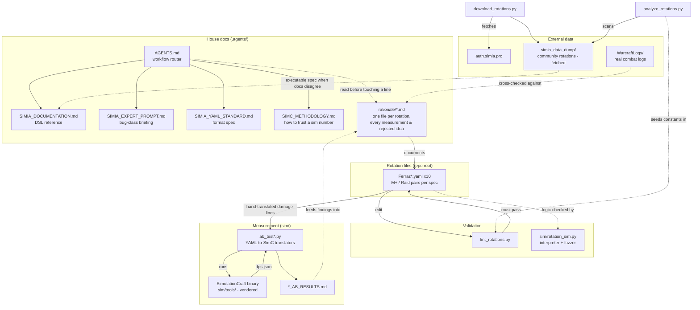
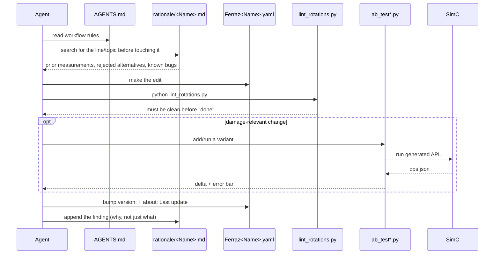
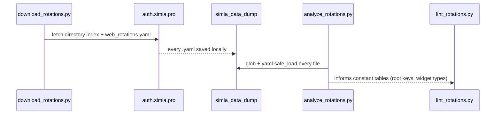

# Codebase Map

> Auto-generated by Cartographer. Last mapped: 2026-09-15T03:20:26Z
>
> **Scope note:** this repo's full scan is 365 files / ~1.6M tokens, but two directories are vendored/fetched third-party content, not authored source, and were deliberately excluded from the deep read below:
> - `sim/tools/` (604k tok, 168 files) — a downloaded SimulationCraft binary distribution (bundled profiles, generators, tests). Not written by this repo; treat it like `node_modules`.
> - `simia_data_dump/` (600k tok, 116 files) — the output of `download_rotations.py`: the entire Simia community rotation catalog, re-fetched on demand. Also not authored here, but it *is* load-bearing reference data — several rotation files quote it as the executable spec when the official docs disagree (see Gotchas).
>
> Everything else — 75 files, ~360k tokens — was read in full by three parallel subagents and is mapped below.

## System Overview

This repo is a personal WoW rotation-authoring workspace targeting **Simia Pro**, a third-party in-game priority-list addon with its own YAML-based DSL. It is not a software product — there's no build, no tests-as-CI, no deploy. The "product" is ten hand-tuned `.yaml` rotation files, and everything else in the repo exists to make editing them safely repeatable: a documentation system that survives context resets, a linter, and a measurement harness.



## Directory Structure

```
.
├── Ferraz*.yaml               10 rotation files - THE product. See Module Guide.
├── settings.yaml              Local HealBotLite/Simia app-state snapshot (not a rotation spec)
├── COMMUNITY_ROTATIONS.md     Curated PT-BR index of community rotations (can drift stale)
├── lint_rotations.py          House linter, reimplements the VS Code extension's rules
├── download_rotations.py      Fetches simia_data_dump/ from auth.simia.pro
├── analyze_rotations.py       One-off DSL-surface scanner over simia_data_dump/
├── expression-catalog.json    Mirrored Simia expression reference (688 entries, 40 categories)
├── arduino_port.txt           COM port for a hardware macro device - unrelated to the DSL
│
├── .agents/                   House documentation system (read BEFORE editing a rotation)
│   ├── AGENTS.md               Workflow router - read this first, always
│   ├── SIMIA_DOCUMENTATION.md  Full DSL reference (Portuguese), 688-expression catalog
│   ├── SIMIA_EXPERT_PROMPT.md  Bug-class briefing - false-friend expressions, recurring traps
│   ├── SIMIA_YAML_STANDARD.md  Formatting contract lint_rotations.py implements
│   ├── SIMC_METHODOLOGY.md     What a SimC number can/cannot prove
│   └── rationale/               One .md per rotation file - the real "why", chronological
│       ├── README.md            Index: rotation file -> rationale file
│       └── <RotationName>.md    x10, one per Ferraz*.yaml
│
├── sim/                        Measurement harness
│   ├── ab_test*.py              6 scripts, one per rotation family, YAML->SimC A/B testing
│   ├── rotation_sim.py          Standalone Simia interpreter/fuzzer (no SimC involved)
│   ├── *_AB_RESULTS.md          Headline findings per harness run
│   ├── Ferraz_*.simc             Baseline gear profiles the harnesses feed to SimC
│   ├── Tassiana_*.simc            The user's own real SimC-addon character exports
│   ├── apl*/                     Saved/generated SimC APL translations, one per rotation
│   ├── bag_*.simc, gem*.simc,     Gear/enchant/trinket profileset sweeps (not A/B harness input -
│   │   trinket_pairs*.simc        standalone stat-optimization runs)
│   ├── dungeon_route.simc        M+ pull-route definition for fight_style=DungeonRoute
│   └── tools/                    VENDORED - SimulationCraft binary distribution. Do not read.
│
├── simia_data_dump/            FETCHED - community rotation catalog. Do not read wholesale;
│                                grep it for specific expressions/spell data when docs disagree.
│
├── WarcraftLogs/                Real combat-log exports, cross-referenced by rationale docs
└── docs/
    └── CODEBASE_MAP.md          This file
```

## Module Guide

### Rotation files (repo root)

**Purpose**: Ten Simia Pro YAML priority-list scripts, one per class/spec, in M+/Raid pairs where both variants exist.

| File | Spec | Content | Version (at mapping time) |
|---|---|---|---|
| `FerrazBalance.yaml` | Balance Druid (102) | M+ | 6.20.0 |
| `FerrazBalanceRaid.yaml` | Balance Druid (102) | Raid | 3.0.0 |
| `FerrazDestruction.yaml` | Destruction Warlock (267) | M+ only | 1.1.0 |
| `FerrazFeral.yaml` | Feral Druid (103) | M+ | 4.5.0 |
| `FerrazFeralRaid.yaml` | Feral Druid (103) | Raid | 2.0.0 |
| `FerrazGuardianElune.yaml` | Guardian Druid (104) | Both (context-gated, one file) | 2.2.0 |
| `FerrazRestoDruid.yaml` | Restoration Druid (105) | M+ | 12.3.1 |
| `FerrazRestoDruidRaid.yaml` | Restoration Druid (105) | Raid | 5.0.0 |
| `FerrazRogueAssassinationRaid.yaml` | Assassination Rogue (259) | Raid only | 5.0.0 |
| `FerrazShamanEle.yaml` | Elemental Shaman (262) | M+ only | 1.6.0 |

**Entry point**: every file sets `entry: main`. `main` is always the terminal dispatcher: cast/channel guard -> `engine` (plumbing) -> out-of-combat utility -> combat wall (`return,if=!player.combat`) -> target-validity guards -> `defensives` -> `interrupts`/`dispels` -> cooldowns/trinkets -> movement split -> stationary damage split by enemy count.

**Dependencies**: `simia_data_dump/_shared.yaml` and siblings for pandemic thresholds and shared data; `expression-catalog.json` indirectly via `.agents/SIMIA_DOCUMENTATION.md`; each file's own `.agents/rationale/<Name>.md`.

**Dependents**: `lint_rotations.py` (validates), `sim/ab_test*.py` (measures the damage half), `sim/rotation_sim.py` (logic-fuzzes), the Simia addon itself in-game (not in this repo).

Full per-file breakdown (lists, key config knobs, gotchas) is large — see the synthesis at the end of this section and the matching `.agents/rationale/<Name>.md` for depth.

### `.agents/` — house documentation system

**Purpose**: A self-contained briefing system so a fresh agent (or a human returning after months) doesn't re-derive or re-break something already settled.

**Entry point**: `AGENTS.md` — read first, every time. It routes to the other four house docs and encodes mechanical requirements that apply to any commit:
- Run `python lint_rotations.py` before finishing any edit; leave it clean.
- Bump the `version:` field and the `about:` config note's `Last update:` text together, on every commit that touches a file — **+1.0** for a new file / priority reorder / spell add-remove / behavior-changing bugfix / hero-tree rebuild, **+0.1** for everything smaller (even comment-only commits).
- Check for a newer SimC nightly before any sim run (plain `http://downloads.simulationcraft.org/nightly/`, not https — cert mismatch; compare via GitHub's compare API since SimC ships no releases).
- Never block `main`'s spell list with a generic `player.casting`/`player.channeling` check except to protect specific channels (Tranquility, Convoke).

**Key files**:
| File | Purpose |
|---|---|
| `SIMIA_DOCUMENTATION.md` | Full DSL reference, Portuguese, 688-expression catalog (section 11) |
| `SIMIA_EXPERT_PROMPT.md` | Bug-class briefing — read immediately before editing any rotation |
| `SIMIA_YAML_STANDARD.md` | Formatting contract `lint_rotations.py` implements |
| `SIMC_METHODOLOGY.md` | What a SimC number can/can't prove; A/B significance rules |
| `rationale/README.md` | Index mapping each rotation file to its rationale doc |
| `rationale/<Name>.md` x10 | Per-rotation changelog — every measurement, rejected alternative, prior bug |

**Gotchas**: absence from the expression catalog is *not* proof an expression is invalid — several real, working expressions (`hero_tree.NAME`, `enemies.around_target`, `cycle.tank`) are undocumented on the official site but confirmed by grepping `simia_data_dump/rotation_*.yaml` (the official rotations function as executable spec, and win when they disagree with the docs).

### `sim/` — measurement harness

**Purpose**: Two independent validation strategies, because SimC only measures damage and most of the interesting bugs in tank/healer files aren't damage bugs.

**Entry points**:
- `sim/ab_test*.py` (6 scripts, one per rotation family) — hand-translate a rotation's damage lists into SimC's APL syntax, generate many single-toggle variants, run SimC, report DPS deltas with significance testing (`abs(delta) > 2*sqrt(e1²+e2²)` on `mean_std_dev`). The "current rotation" baseline variant is always named after the file (`ferraz`, `raid_ferraz`).
- `sim/rotation_sim.py` — a from-scratch Simia expression parser and tiny game-state interpreter. Replays a rotation pass exactly like the addon (first matching line wins) over a fixed grid of scenarios or randomized fuzz states, looking for `LOOP` (shapeshift ping-pong), `STALL` (nothing fires in combat), dead lines, and always-true conditions. Unmodeled expressions evaluate to `UNKNOWN` (treated false) with a `--unknowns` flag to list what's missing.

**Dependencies**: `sim/tools/simc-*/simc.exe` (vendored binary, not read by cartographer); `sim/Ferraz_*.simc` / `sim/Tassiana_*.simc` gear profiles; `sim/dungeon_route.simc` for the M+ fight-style proxy.

**Dependents**: `.agents/rationale/*.md` (findings get written back there); `*_AB_RESULTS.md` (headline summaries per family).

**Gotchas**: every `ab_test*.py` script's docstring/comments catalog what Simia expressions have **no SimC equivalent** and are pinned to a fixed value or dropped (`target.in_melee`, `var.heavy_incoming`, `cycle.*`, `debuff.X.visual_id`, `player.combat` since SimC is always in combat). Trusting the translation without reading those notes produces a fake result — one harness bug once measured a fictitious +244% by accidentally adding an unconditional cast the YAML never had.

### Root Python scripts

- **`lint_rotations.py`** — validates format (2-space indent, blank-line rules), action-line syntax (balanced parens, `call_action_list` needs `name=`), reference validity (`config.X`/`var.X` must be defined), and a repo-specific check added after a real incident: a bare value starting with `!` or `&` is a YAML tag/anchor, not a boolean operator, and silently breaks the file — must be quoted. Does **not** validate spell names (no offline spell DB) or `cfg.X` (only `config.X`).
- **`download_rotations.py`** — fetches the entire community rotation catalog from `auth.simia.pro` into `simia_data_dump/`. No `if __name__` guard; runs on import.
- **`analyze_rotations.py`** — scans `simia_data_dump/` to inventory the DSL surface actually seen across the community catalog (root keys, config widget types, step modifiers, action names). Its output appears to have seeded `lint_rotations.py`'s hardcoded constant tables.

## Data Flow

### Editing a rotation (the enforced workflow)



### Refreshing community reference data



## Conventions

- **Effective vs. raw HP**: most HP% thresholds read `health.pct` (raw). A deliberate subset — Guardian's Frenzied Regeneration, all Restoration thresholds, mouseover-emergency heals — read `health.effective.pct` (raw minus heal-absorb plus incoming heals) instead, specifically to avoid spending a cooldown on a target another heal already covers. Every file that deviates from its own norm says why in a comment.
- **TTD (time-to-die) gating**: `var.X_ttd_ok: (target.boss|target.time_to_die>=config.ttd_X|fight_remains>=config.ttd_X)` — a boss always bypasses the check. Standard on every long cooldown in M+ files; mostly dropped in Raid siblings (raid pulls are long and known-duration).
- **Predicted + reactive defensive pairs**: personal defensives fire twice — once on `incoming.pct`/`incoming.mitigated.pct` (predictive, explicitly "unvalidated by simulation" since SimC can't model incoming raid damage) and once on a plain HP% floor as a reactive fallback.
- **Mouseover as the only off-target tool**: Simia cannot cycle/search enemies by criteria (`target_enemy` is nearest-only, no filter). Soothe-enrage, DoT-spread, multidotting, and Rebirth/Revive all rely on `mouseover.*` expressions for this reason.
- **Numeric spell IDs over names**: used whenever a name would collide with another form/spec's version of the same button (Guardian's `77758` Thrash, `213764` Swipe; Resto's `774` Rejuvenation, `1822` Rake).
- **`spell_overrides:`** (sibling of `config:` at file root): ANDs a guard onto every occurrence of a named spell across the file, used sparingly (Balance, Guardian) instead of repeating a condition per line.
- **The five-guard block**: `return,if=!state.rotation / player.dead / state.blocked_inputs / mounted / (travel_form paused)` appears near-verbatim at the top of every `engine` list.
- **`engine` is always inlined**, never inherited from Simia's shared `_shared.yaml` — deliberate, so every piece gets its own `config.engine_*` toggle instead of an opaque shared default.
- **Versioning**: semver-ish, bumped on every commit per `AGENTS.md` rule 6 (+1.0 major behavior change, +0.1 everything smaller), with the YAML's `about:` note text kept byte-in-sync with the root `version:` field.
- **M+/Raid divergence discipline**: the two files of a pair should differ *only* in damage-list priorities — defensives, dispels, interrupts, and opening checks are meant to stay identical, and a fix to one should be checked against its twin. Config-key naming for the split is inconsistent across pairs: Restoration Raid prefixes every key `raid_*`; Balance/Feral Raid reuse the same unprefixed key names as their M+ sibling.

## Gotchas

- **The repo's own `.gitignore` breaks naive tooling.** It uses an "ignore everything, then allow-list back" pattern (`*` then `!*/` then `!*.yaml`). Any tool with simplified/non-standard gitignore parsing (no negation support) will see **zero files** in this repo — this happened during this very mapping run and was worked around by temporarily renaming `.gitignore`, scanning, then restoring it immediately.
- **`active_enemies` is a nameplate count, not combat-filtered.** A recurring bug source across multiple rotation files (Balance, Guardian) — use `enemies.combat.<range>y` instead.
- **`player.auto_combat` vs `player.combat`** — the former is a config toggle check, not actual combat state. Conflating them "silently disabled four rotations in this repo" per `SIMIA_EXPERT_PROMPT.md`.
- **`health.effective.pct` adds incoming heals** — correct for routine HoT-upkeep thresholds (avoids overheal), wrong for genuine emergencies, where it can mask real danger. Both directions have been deliberately chosen and reversed at different points in the Restoration files' history — check the rationale doc for *why* before assuming either is "correct."
- **`cycle=` lines need the `cycle.` prefix.** A bare `buff.X` on a `cycle=tanks`/`cycle=members` line silently reads the *player*, not the cycled unit — a recurring bug class.
- **Trust SimC's `Attributes`/`Talent Entry` spell-query fields, not its `Description` prose** — a worked example in `Balance.md` shows the description omitting that Fluid Form's Starfire also returns you to Moonkin Form, which produced a confidently wrong claim, twice.
- **A cooldown timer can't distinguish "just cast" from "still active."** `ShamanEle.md` documents a real bug where `cooldown.ascendance.remains` was used as a proxy for "not in Ascendance right now" — structurally wrong, since both states read a large remaining-cooldown number. Fixed by checking `!buff.ascendance.up` directly.
- **A single spell name can resolve to the wrong spell ID.** `GuardianElune.md` documents querying `spell.name=heart_of_the_wild` returning an obsolete 300s-cooldown/45s-buff version instead of the real 120s/1-second morph the current build uses — this invalidated an earlier design justification until corrected by ID.
- **The linter is not a semantic engine.** It cannot validate spell names (no offline DB) and does not check `cfg.X` (only `config.X`). Passing lint does not mean the rotation is logically correct — see `sim/rotation_sim.py` for that half.
- **`sim/tools/` and `simia_data_dump/` are excluded from this map on purpose.** They're large, vendored/fetched, and not authored here — treat them as data, not code, when navigating.

## Navigation Guide

**To fix a reported rotation bug**: get the exact `name="..."` line from the addon's execution log or a live snapshot first (don't reason from the YAML alone — multi-caller bugs are the recurring root cause) → grep the matching `.agents/rationale/<Name>.md` for prior mentions → check `.agents/SIMIA_EXPERT_PROMPT.md`'s false-friend expression table → make the fix → `python lint_rotations.py` → append the finding to the rationale file, not just the diff.

**To add a new rotation file**: copy the `engine`/`main`/five-guard-block skeleton from an existing same-role file (tank -> Guardian, healer -> Restoration, melee DPS -> Feral/Rogue, ranged -> Balance/Destro/Shaman) rather than starting blank; create a matching `.agents/rationale/<Name>.md` per the `README.md` convention; add a `selected_rotation:` entry pattern awareness in `settings.yaml` if wiring it into the local addon config.

**To measure whether a change helps DPS**: check `.agents/SIMC_METHODOLOGY.md` first for what's even measurable for that spec/role (Guardian and Restoration are half-unmeasurable). Find or add a variant in the matching `sim/ab_test*.py`, run it, and report delta + error bar + target count + fight style + binary version — a number missing any of those cannot be checked later.

**To update the SimC binary**: follow `AGENTS.md` rule 7 / `SIMC_METHODOLOGY.md` section 6 — compare local vs. nightly build via GitHub's compare API (plain HTTP for the nightly listing itself), get approval before downloading, extract with `py7zr` via the `py` launcher (not `python`), strip the Qt GUI, then re-verify the most important recent finding before trusting the new binary.

**To refresh community rotation data**: run `download_rotations.py`, then optionally `analyze_rotations.py` to see what new DSL surface appeared. Grep `simia_data_dump/rotation_*.yaml` directly rather than reading it wholesale when checking whether an expression is real.

**To check documentation is self-consistent**: `.agents/SIMIA_DOCUMENTATION.md` mirrors `expression-catalog.json`, which itself mirrors the Simia addon's own site (`auth.simia.pro`, blocked by generic WebFetch — needs `curl -A "Mozilla/5.0"`). If a number in the docs (e.g. total expression count) looks stale, re-fetch the catalog and diff before editing.
